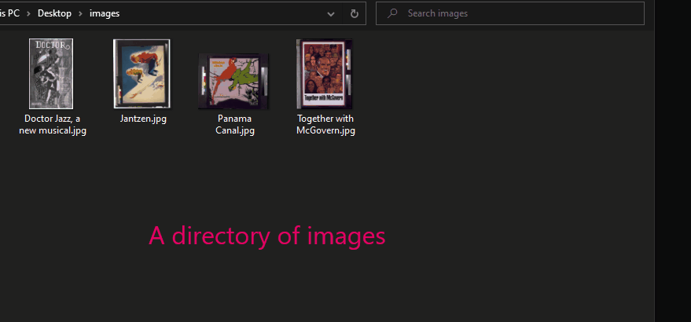
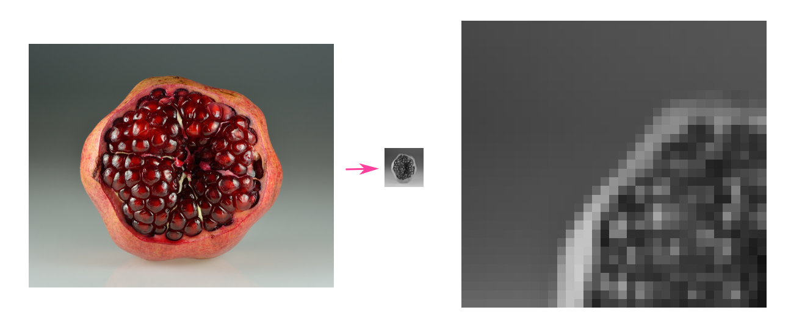
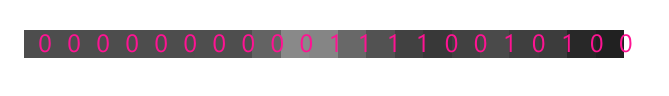

# imgdupe

Group perceptually similar images from among image paths.



Inspired by <https://www.hackerfactor.com/blog/?/archives/529-Kind-of-Like-That.html> and <https://github.com/cetra3/dhash>.

## Usage

```text
Usage: imgdupe [OPTIONS] [PATHS]...

Arguments:
  [PATHS]...
          Files to hash, or directories to walk to find files to hash. Only supported image formats will be hashed.

          A warning will be emitted if the extension of the file is one that should be supported, but was not able to be decoded.

Options:
  -s, --side <SIDE>
          This parameter lets you adjust the precision of the similarity check. More precisely, it determines the dimension of one side of the square image after it has been resized. Lower values will result in loss of detail from the image (creating a more pixelated image, e.g., 8x8), whereas higher values will retain more detail (resulting in a higher resolution image, e.g., 64x64).

          Tune this value according to your desired false positive/negative rate. Note that computational complexity scales quadratically with it.

          [default: 8]

  -h, --help
          Print help (see a summary with '-h')

  -V, --version
          Print version
```

## Hashing Algorithm

The details are outlined in the blog post above, but we extend on it by allowing
the user to specify the hash size. This lets the user adjust the sensitivity of
the algorithm, or in other words, how similar the images have to be to be
considered duplicates.

Here's how it works:

1. Accept a `side` parameter from the user. (We default to 8 pixels.)

2. Resize the image to `side` by `side` pixels and convert it to grayscale.

   

3. For each row, for each pair of neighboring pixels, if the left pixel is
   brighter than the right pixel, append a `1` to the hash. Otherwise, append a
   `0`. (For the last pixel in the row, we compare it to the first of the row.)
   The resulting hash will be `side` * `side` bits long.

   
